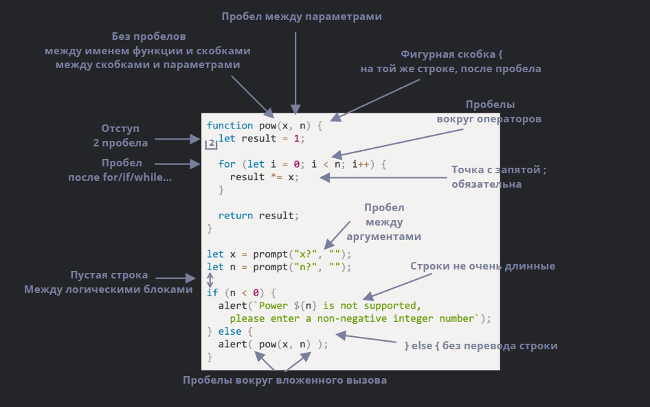

# Отладка кода

## debugger

```js
// Функция для вычисления факториала числа
function factorial(n) {
    debugger; // Точка останова для отладки
    if (n < 0) {
        return "Ошибка: число не может быть отрицательным!";
    }
    let result = 1;
    for (let i = 1; i <= n; i++) {
        result *= i;
    }
    return result;
}

// Пример вызова функции
console.log(factorial(5)); // Ожидаемый результат: 120
console.log(factorial(-3)); // Ожидаемый результат: Ошибка: число не может быть отрицательным!
```

## Code style



## JS Documentation, JSDoc

```js
/**
 * Возвращает x, возведённое в n-ную степень.
 *
 * @param {number} x Возводимое в степень число.
 * @param {number} n Степень, должна быть натуральным числом.
 * @return {number} x, возведённое в n-ную степень.
 */

function pow(x, n) {
    return x ** n;
}
```

## Ниндзя-код

```js
i = i ? (i < 0 ? Math.max(0, len + i) : i) : 0;

```
`
list → lst.
userAgent → ua.
browser → brsr.
`

`
obj, data, value, item, elem и т.п.
`

## Behavior Driven Development (BDD)

BDD – это три в одном: и тесты, и документация, и примеры использования.